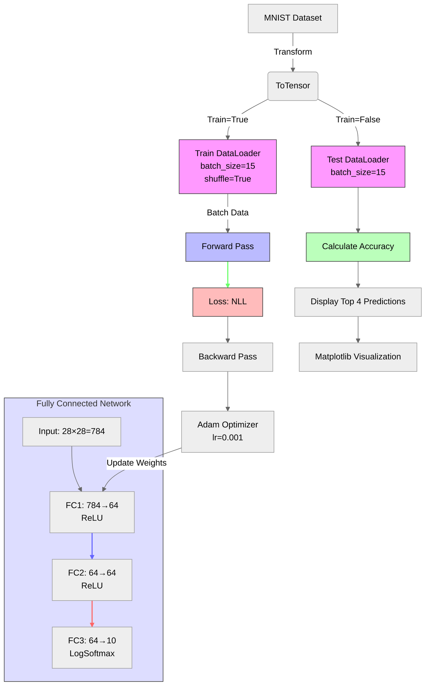

```mermaid
%%{init: {'theme': 'neutral', 'fontFamily': 'Arial'}}%%
graph TD
    %% Data Pipeline
    A[MNIST Dataset] -->|Transform| B(ToTensor)
    B -->|Train=True| C[Train DataLoader<br>batch_size=15<br>shuffle=True]
    B -->|Train=False| D[Test DataLoader<br>batch_size=15]
    
    %% Model Architecture
    subgraph FCN[Fully Connected Network]
        direction LR
        E[Input: 28×28=784] --> F[FC1: 784→64<br>ReLU]
        F --> G[FC2: 64→64<br>ReLU]
        G --> H[FC3: 64→10<br>LogSoftmax]
    end
    
    %% Training Process
    C -->|Batch Data| I[Forward Pass]
    I --> J[Loss: NLL]
    J --> K[Backward Pass]
    K --> L[Adam Optimizer<br>lr=0.001]
    L -->|Update Weights| F
    
    %% Evaluation
    D --> M[Calculate Accuracy]
    M --> N[Display Top 4 Predictions]
    N --> O[Matplotlib Visualization]
    
    %% Key Components
    style C fill:#f9f,stroke:#333
    style D fill:#f9f,stroke:#333
    style FCN fill:#ddf,stroke:#333
    style I fill:#bbf,stroke:#333
    style J fill:#fbb,stroke:#333
    style M fill:#bfb,stroke:#333

    %% Data Shapes
    linkStyle 0,1 stroke:#666,stroke-width:1px
    linkStyle 4 stroke:#66f,stroke-width:2px
    linkStyle 5 stroke:#f66,stroke-width:2px
    linkStyle 7 stroke:#6f6,stroke-width:2px
```

